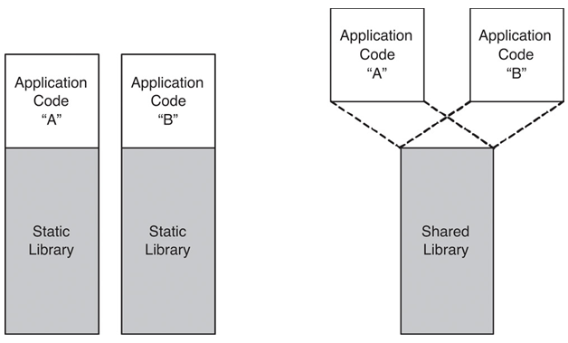

# What is Library ?

- it is group of pre-compiled codes, called functions
- to avoid repetition of code, package is created, called Library

Note: Library is not an executable

they are either used at
- compile time
- run time


# Introduction
Static library is sometimes called an archive since it is just a package of compiled object files.

usually called
- static linking
- early binding

staticlly linked.

static linking must be be performed when any modules are recompiled.

This process, and the resulting stand-alone file, is known as a static build of the program.


# Types of Libraries
- Dynamic Library
- Static Library

# Steps to create Executable File

- source file to compiler to convert to machine code and linker
- then object file given to the linker to combine and create an executable file

# Linker's Task
1) Copying the code of the library function into your object code
2) Complete code of library function is not copied but made avaible at run time

```bash

$ g++ -c lib_add.cpp -o lib_add.o
$ g++ -c lib_sub.cpp -o lib_add.o
$ ar rcs lib_calc.lib lib_add.o lib_sub.o
$ g++ -c main.cpp -o main.o
$ g++ -o main main.o -L. lib_calc.lib (this)
$ g++ -o main main.o -L. -l_calc (or this)
$ .\main.exe
$ Hello World
$ Addition result = 15
$ Subtraction result = 5
```

`ar` archive to create static library
`rcs` replace and create new library if does not exist or update if exist

# Static Library / Static Linking
- Linker makes a copy of all library functions to executable file
Note: static library have extension `.a` in linux and `.lib` in windows.



The filenames always start with lib, and end with .a (archive, static library) on Unix/Linux, and on Windows it's a little bit complicated. Depending on how they are compiled, *.LIB files can be either static libraries or representations of dynamically linkable libraries needed only during compilation, known as Import Libraries. Unlike in the UNIX world, where different file extensions are used, when linking against *.LIB file in Windows one must first know if it is a regular static library or an import library. In the latter case, a .DLL file must be present at run time.

Here are implications of distributing our implementation as a static library:

1. A static library is only needed to link an application. It is not needed to run that application because the library code is already embedded inside the application. So, our clients can distribute their applications without any additional run-time dependencies.
2. If our clients want to link our library into multiple executables, each one will embed a copy of our code. If our library is 100MB in size, and our client wishes to link this into three separate programs, then we could be adding up to 300MB to the total size of their product. Notice that only the object files in the static library that are actually used are copied to the application. Thus, in reality, the total size of each application could be less than this worst case.
3. Our clients can distribute their applications without any concerns that it will find an incompatible library on the end-user's side or a completely different library with the same name from another vendor.
4. But if our clients want to be able to hot patch their application, in other words, they want to update the version of our library used by their application, they must replace the entire executable to achieve this. If this is done as an internet-based update, the end user may have to download a much larger update and hence wait longer for the update to complete.


# Resources
- https://www.youtube.com/watch?v=3RmIVDgPmGk
- https://www.bogotobogo.com/cplusplus/libraries.php#:~:text=A%20static%20library%20contains%20object,%2Fusr%2Flocal%2Flib.

